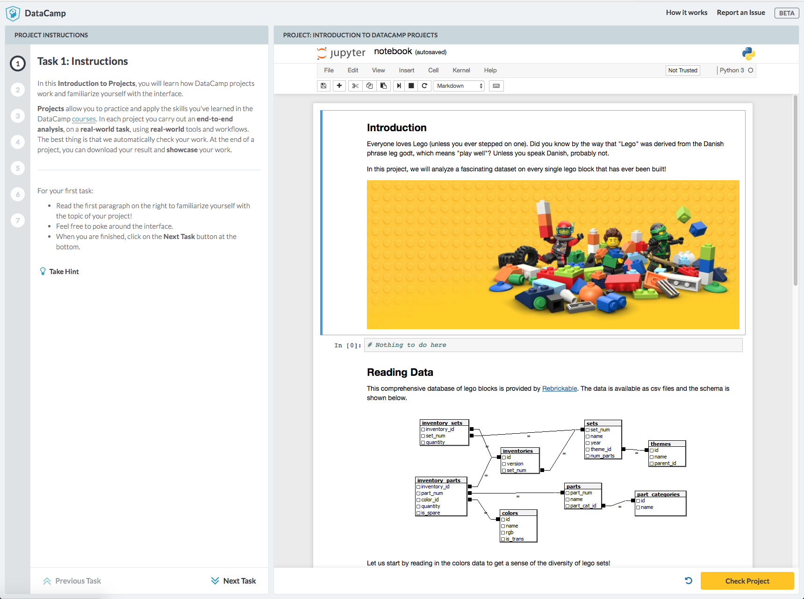

# Welcome

Everybody can teach by using the DataCamp platform. This documentation aims to be a comprehensive guide to creating your own content on DataCamp.

## What content can I create?

Datacamp supports different types of content you can create being:

### Courses
Purpose of creating the course is to educate your students on the subject through the series of videos, slides and different exercises.  

A good example of a course is [_Introduction to SQL for Data Science_](https://www.datacamp.com/courses/intro-to-sql-for-data-science) which you can start for free to familiarize yourself with the Datacamp Learn environment.

Feeling ready to create a course yet? __[Start now](courses/README.md)__

### Challenges
Once your students have finished taking the course you may want to strenghthen their knowledge by creating challenges.  
Challenges are different to courses as the sole purpose is to question student's knowledge. All challenges presented to the student are always randomized, a good example of how the challenges interface looks like is:

> #### info::Note
> _Challenges are going to be available soon, meanwhile you can read the [documentation](challenges/README.md)_

### Projects
Seems your students are performing well completing all your courses and challenges. The newest addition to the Datacamp learning portfolio is Projects.

The purpose of projects is to allow students to apply their knowledge by resolving real world problems.

> #### info::NOTE
> _Projects are going to be available soon, meanwhile you can read the [documentation](projects/README.md)_