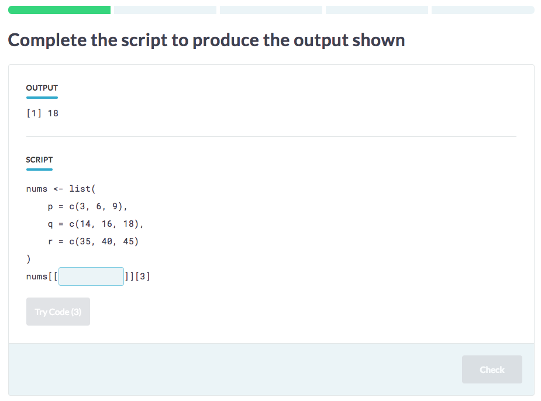
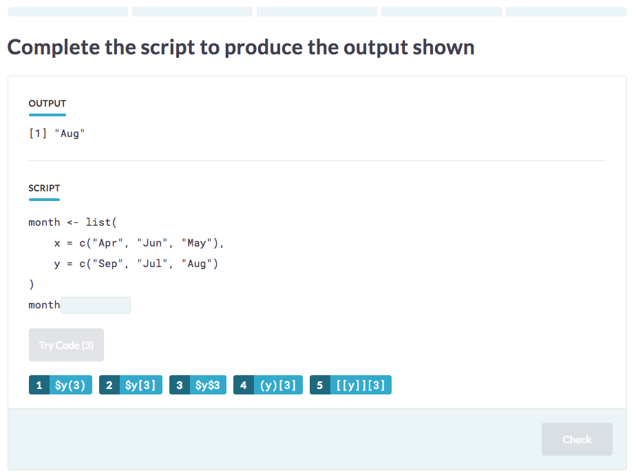

# Blanks Challenge

In a `BlanksChallenge`, the student is presented a 'required output', and has to fill in the blanks of a script in such a way that, when executed, the script produces the same output as the required output.



The `variables` are added with YAML syntax. In the `code` block, you have to prepend the variable name with a `_` if you want to turn this into a blank in the interface.

    ## Complete the Script

    ```yaml
    type: BlanksChallenge 
    ```

    `@code`

    ```{r}
    x <- {{_var1}}
    y <- {{_var2}}
    list(x, y)
    ```

    `@variables`

    ```{yaml}
    var1:
      - 'c(1, 2)'
      - 'c(3, 4)'
    var2:
      - 'c(7, 8)'
      - 'c(9, 10)'
    ```

If a student encounters this challenge, the backend will randomly choose a value for `var1` and `var2`. Suppose that the backend selects `c(1, 2)` for `var1` and `c(7, 8)` for `var2`, then the student is expected to fill in the blanks as follows:

```r
x <- c(1, 2)
y <- c(7, 8)
```

## Blanks Challenge with Distractors

This is a variant of the `BlanksChallenge`, where the interface displays a set of code snippets to choose from in order to complete the script.



    ## Complete the Script

    ```yaml
    type: BlanksChallenge 
    ```

    `@code`

    ```{r}
    x <- {{_var1}}
    y <- {{_var2}}
    list(x, y)
    ```

    `@variables`

    ```{yaml}
    var1:
      - 'c(1, 2)'
      - 'c(3, 4)'
    var2:
      - 'c(7, 8)'
      - 'c(9, 10)'
    ```

    `@distractors`

    ```{yaml}
    var1:
      - '{{var1}}'
      - 'c(5, 6)'
    var2:
      - '{{var2}}'
      - 'c(11, 12)'
    ```

In addition to what is displayed for a free form `BlanksChallenge`, four distractors will be added to the list: `c(3, 4)`, `c(5, 6)`, `c(9, 10)` and `c(11, 12)`. In the `distractors` block, you can specify both a `variable` and extra `distractors`. If you specify a `variable`, all other options, that are not the target, will be considered to add to the `distractors` list. The additional distractors you can add for each blank allow you to also specify distractors that you don't want to be used as 'target blanks'.


## Free-form Blanks Challenges

You can also write up a BlanksChallenge without specifying `distractors`, like this:

    ```yaml
    type: BlanksChallenge 
    ```

    `@code`

    ```{r}
    x <- {{_var1}}
    y <- {{_var2}}
    list(x, y)
    ```

    `@variables`

    ```{yaml}
    var1:
      - 'c(1, 2)'
      - 'c(3, 4)'
    var2:
      - 'c(7, 8)'
      - 'c(9, 10)'
    ```

In this case, a similar interface with blanks will be shown, but this time the student is not presented with options to fill in into the blanks. Instead, the student is required to type in the blanks.

## Multiple options

Similar to the `OutputChallenge`, it is possible to specify several code blocks in `BlanksChallenge`. When generating a view from the challenge , the challenge backend will start by randomly selecting one of these code blocks:

    ```yaml
    type: BlanksChallenge 
    ```

    `@code1`

    ```{r}
    x <- {{_var1}}
    y <- {{_var2}}
    list(x, y)
    ```

    `@code2`
    ```{r}
    x <- {{_var1}}
    y <- {{_var2}}
    z <- {{_var3}}
    list(x, y, z)
    ```

    `@distractors`

    ```{yaml}
    var1:
      - '{{var1}}'
      - 'c(5, 6)'
    var2:
      - '{{var2}}'
      - 'c(11, 12)'
    var3:
      - '{{var3}}'
      - 'c(17, 18)'

    *** =variables
    var1:
      - 'c(1, 2)'
      - 'c(3, 4)'
    var2:
      - 'c(7, 8)'
      - 'c(9, 10)'

    var3:
      - 'c(13, 14)'
      - 'c(15, 16)'
    ```

Of course, if you want to make a free-form `BlanksChallenge`, you can also specify multiple codeX blocks when you don't specify `distractors`.