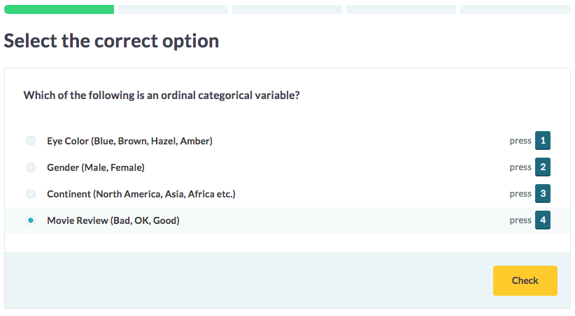

# MultipleChoiceChallenge

A `MultipleChoiceChallenge` presents the student with a block of text that can be a statement or question, and the student has to select the correct option.



It is possible to specify several assignment/options pairs; the backend will randomly pick from these. You can enclose options between `[ ]`, to indicate that they are correct.

## Authoring



## Choose the right answer

```yaml
type: MultipleChoiceChallenge
```

***

`@assignment`

Which function convert a character string to uppercase?

`@options`

- `upper()`
- [`toupper()`]
- `caps()`
- `allcaps()`

***

`@assignment`

Which function adapts the casing of a character string?

`@options`

- `lower()`
- `upper()`
- [`tolower()`]
- [`toupper()`]
- `smallcaps()`
- `allsmallcaps()`



--- type:MultipleChoiceChallenge
## Choose the right answer

*** =assignment1
Which function convert a character string to uppercase?

*** =options1
- `upper()`
- [`toupper()`]
- `caps()`
- `allcaps()`

*** =assignment2
Which function adapts the casing of a character string?

*** =options2
- `lower()`
- `upper()`
- [`tolower()`]
- [`toupper()`]
- `smallcaps()`
- `allsmallcaps()`



If a student encounters this challenge, he/she gets to see either the first or the second assignment. The challenge backend will randomly select 3 incorrect options and one correct option to present to the student.

The `## Choose the right answer` title is not required and can be used to keep your challenges organized and easily searchable. This information is nowhere used in the frontend nor backend.

Also notice that you can use markdown to specify the assignments and options. Here, we're dealing with function names, so we're using `backticks` to show the options in code tags.