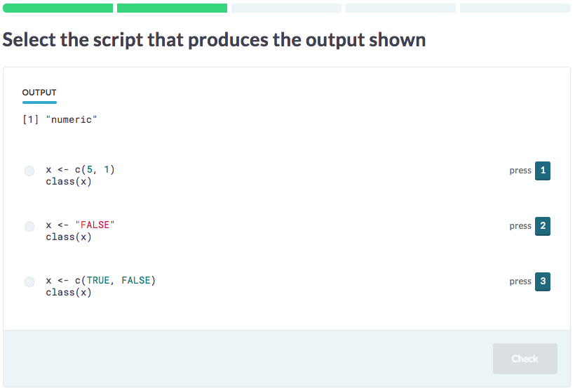

# Output Challenge

In an `OutputChallenge`, a student has to match code with the corresponding output, or match output with the corresponding code.



## Authoring

Every `OutputChallenge` starts with a title (optional) and metadata.



## Functions

```yaml
type: OutputChallenge
```



--- type:OutputChallenge

## Functions




### Code

The code block provides a template to generate options for a challenge. It contains references to the variables with `{{ }}` notation.
For example, the code template below uses for variables `var1`, `var2` and `fun1`, whose values are dynamically generated based on the values specified in the variables block.



`@code`

```{r}
x <- {{var1}}
y <- {{var2}}
{{fun1}}(x, y)
```



*** =code

```{r}
x <- {{var1}}
y <- {{var2}}
{{fun1}}(x, y)
```



#### Anchoring

To limit the variability between the different options that are generated, it's possible to 'anchor' certain variables. Have a look at this example:



`@code`

```{r}
x <- {{$var1}}
y <- {{$var2}}
{{fun1}}(x, y)
```



*** =code

```{r}
x <- {{$var1}}
y <- {{$var2}}
{{fun1}}(x, y)
```



By prepending `var1` and `var2` with `$`, we're slightly changing the way the four code-to-output or output-to-code options are generated. Instead of randomly selecting a value for `var1`, `var2` and `fun1` for each option, a value for `var1` and `var2` will only be chosen once. All the options that are generated will now use the same var1-var2 combination, and only fun1 will be varied for the different options.

This will typically be useful if you're working with data variables, and you don't want the different options to contain very different dummy data to start from. With anchoring, you prevent the options from being too different, but there's still a high degree of randomization, because the anchored variables are still randomly chosen in the first stage.

#### Multiple Code Blocks

In some cases, you might want to specify several code templates. In this case, for the generation of each option, the backend will first randomly select one of the two templates, and next randomly fill it in based on the provided options for the variables. It's therefore perfectly possible that 2 out of four generated options come from the first template, and the other two come from the second template.



`@code`

`@code1`
```{r}
x <- {{var1}}
y <- {{var2}}
{{fun1}}(x, y)
```

`@code2`
```{r}
x <- {{var1}}
y <- {{var2}}
z <- {{var3}}
{{fun1}}(x, y, z)
```



*** =code1
```{r}
x <- {{var1}}
y <- {{var2}}
{{fun1}}(x, y)
```

*** =code2
```{r}
x <- {{var1}}
y <- {{var2}}
z <- {{var3}}
{{fun1}}(x, y, z)
```



### Variables

You can specify variables as a list of values for each variable name, and the backend will use them to randomly generate a view from a challenge. These variables are 'local', so they can only be referenced in the challenge where they are specified.




`@variables`

```{yaml}
var1:
  - 'list(p = c(3, 9))'
  - 'list(q = c(8, 4))'
  - 'list(r = c(2, 6))'
var2:
  - 'c(3, 4)'
  - 'c(1, 2)'
  - 'c(7, 5)'
  - 'c(8, 6)'
fun1:
  - 'c'
  - 'list'
```



*** =variables

var1:
  - 'list(p = c(3, 9))'
  - 'list(q = c(8, 4))'
  - 'list(r = c(2, 6))'
var2:
  - 'c(3, 4)'
  - 'c(1, 2)'
  - 'c(7, 5)'
  - 'c(8, 6)'
fun1:
  - 'c'
  - 'list'



Instead of exhaustively specifying all the values - like all of the examples above - a variable's value can also be defined as an R or Python expression (depending on the language you're writing up a pool for). Take this example:



`@variables`

```{yaml}
var1:
  - '!expr sprintf("c(%s)", paste(sample(-4:4, 4), collapse = ", "))'
  - 'c(1, 1, 1, 1)'
fun1:
  - '!expr sample(c("var", "mean", "sd", "max", "min"), 1)'
```



*** =variables

var1:
  - '!expr sprintf("c(%s)", paste(sample(-4:4, 4), collapse = ", "))'
  - 'c(1, 1, 1, 1)'
fun1:
  - '!expr sample(c("var", "mean", "sd", "max", "min"), 1)'



When the challenge backend renders this kind of challenge and tries to find a valid value for `var1`, it will first execute the `sprintf(...)` expression. It will use the values that result from that as if they were hard coded values. This allows you to make the number of possibilities virtually endless. Notice that you can still specify hardcoded values in addition to 'expression values', as the `'c(1, 1, 1, 1)'` example shows. This is supported for R, Python and SQL now.

#### Complete example

Here is the complete `OutputChallenge` example:


## Functions

```yaml
type: OutputChallenge
```

`@code`

```{r}
x <- {{var1}}
y <- {{var2}}
{{fun1}}(x, y)
```

`@variables`

```{yaml}
var1:
  - 'list(p = c(3, 9))'
  - 'list(q = c(8, 4))'
  - 'list(r = c(2, 6))'
var2:
  - 'c(3, 4)'
  - 'c(1, 2)'
  - 'c(7, 5)'
  - 'c(8, 6)'
fun1:
  - 'c'
  - 'list'
```


--- type:OutputChallenge

## Functions

*** =code
```{r}
x <- {{var1}}
y <- {{var2}}
{{fun1}}(x, y)
```

*** =variables
var1:
  - 'list(p = c(3, 9))'
  - 'list(q = c(8, 4))'
  - 'list(r = c(2, 6))'
var2:
  - 'c(3, 4)'
  - 'c(1, 2)'
  - 'c(7, 5)'
  - 'c(8, 6)'
fun1:
  - 'c'
  - 'list'


### Pre Challenge Code

Often, you'll want to use a bit more advanced code for your expression values, and potentially reuse this. You can use the optional `pre_challenge_code` block for this. When the backend executes the expression to generate a value, it will first execute this code. You can think of it as initialization code. The challenge from previous section can thus be rewritten as:



`@pre_challenge_code`

```{r}
generate_vector <- function(x) {
  sprintf("c(%s)", paste(sample(-4:4, x), collapse = ", "))
}
```

`@variables`

```{yaml}
var1:
  - '!expr generate_vector(4)'
fun1:
  - '!expr sample(c("var", "mean", "sd", "max", "min"), 1)'
```



*** =pre_challenge_code
```{r}
generate_vector <- function(x) {
  sprintf("c(%s)", paste(sample(-4:4, x), collapse = ", "))
}
```

*** =variables
var1:
  - '!expr generate_vector(4)'
fun1:
  - '!expr sample(c("var", "mean", "sd", "max", "min"), 1)'



The `pre_challenge_code` is also run before the student tries out code or does a submission when he or she is actually taking a challenge, so you can also use it to pre-initialize your workspace. This can be useful, for example,when you want students to interact with a complex data frame that requires a lot of code to set up, but that you don't want people to see. Take care, however, in using this feature, as it can reduce the overall understandability of your code. If you don't provide extra information in the context, this can lead to obscure challenges!

### Context

In some cases, you might want to specify a bit more context with the challenge at hand. You can do this by optionally specifying a `context` block. This context part will be parsed as markdown, and shown in a simple div at the top of the view.




```yaml
type: BlanksChallenge 
```

`@context`

This is some extra context. You should only use this when it's _really_ required!



--- type:BlanksChallenge

*** =context

This is some extra context. You should only use this when it's _really_ required!




## YAML Syntax

To specify both `variables` and `distractors`, you have to use YAML syntax. YAML is powerful, but sometimes peculiar. To make sure it always behaves as expected, we suggest you _always_ wrap every variable in single quotes. This will be easiest. This becomes a bit odd if you want to specify a string, with quotes:

    el1:
      - 'quotes not kept'
      - '"double quotes"'
      - "'single quotes'"
      - '"this isn''t a problem"'

To see how this particular piece of YAML is parsed, you can use http://yaml-online-parser.appspot.com/ to check. If you check out the JSON output for the example above, it will be:

    {
      "el1": [
        "quotes not kept",
        "\"double quotes\"",
        "'single quotes'",
        "\"this isn't a problem\""
      ]
    }

Here, it becomes clear that the first element indeed does not keep the single quotes, while the other ones do.

