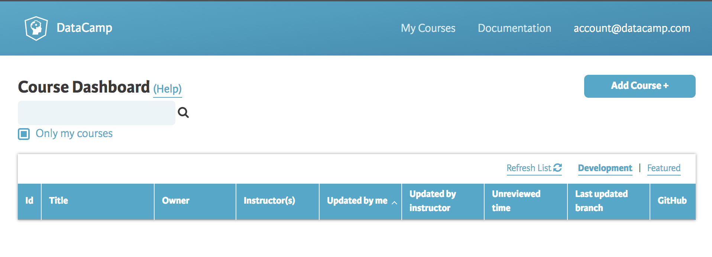
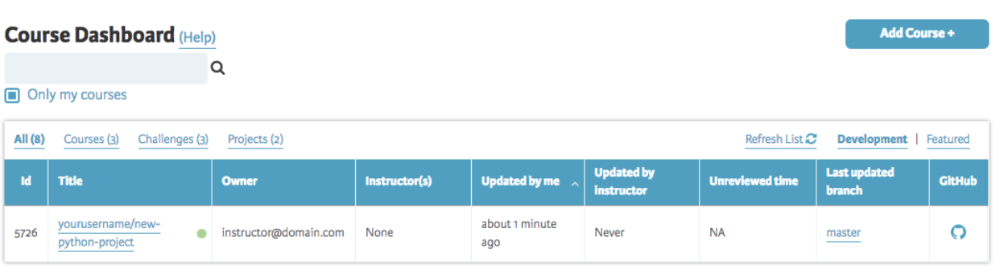

# Courses

Course consists of series of videos, slides and different types of exercises. The goal of each course is to provide lectures along with hands on code or learning by doing.

## Creating courses

In order to start creating courses make sure you are signed in your [DataCamp](https://www.datacamp.com) account.

Once signed in be sure to open the [DataCamp for Teachers](https://www.datacamp.com/teach).

_[DataCamp for Teachers - Dashboard](../interface/dashboard.md)_ 

In order to create a new course click on "Add Course +" button, following dialog should appear:

_DataCamp for Teachers - Create Course dialog_

The information which is required is the `name` of the course and technology being `R`, `Python` or `SQL`. Specify a nice name for your first course such as `best-course` (_name must be lowercase with dashes instead of spaces_) and select the technology which suits you the best.

Once ready click the "Create" button.

> #### info::NOTE
> Creating the course can take a few moments.

Once the course has been created your Dashboard should contain recently created course:

_DataCamp for Teachers - Course dashboard_

### So what just happened?
__Congratulations! You just created your first course!__  
Following actually happened behind the scenes after you have clicked "Create" button:

1. DataCamp has created a course populated with scaffolded exercises and information
2. The course has been pushed (uploaded) to your Github account in a repository named `best-course`
3. Feel free to visit your newly created Github repository (*you can find it by opening your Github account and searching for repository with name `best-course`*)

**[Next: Learn about the course data structure](repo-structure.md)**