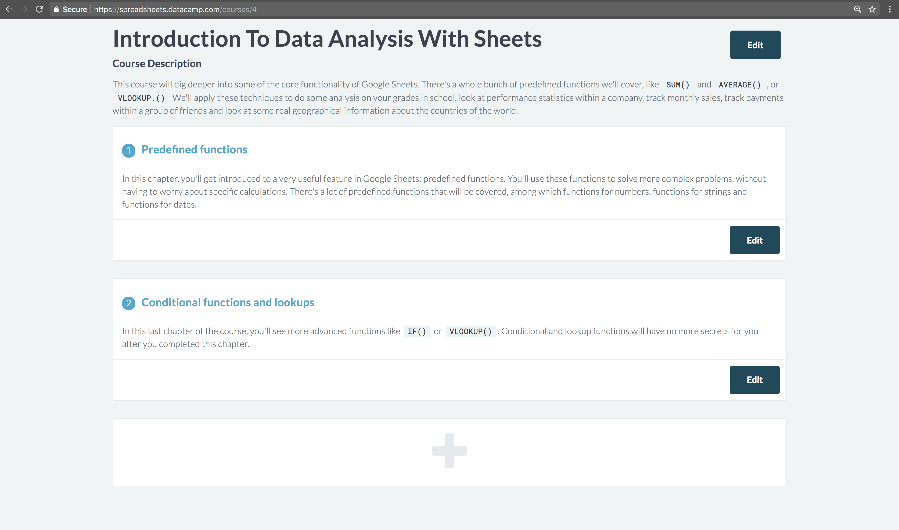
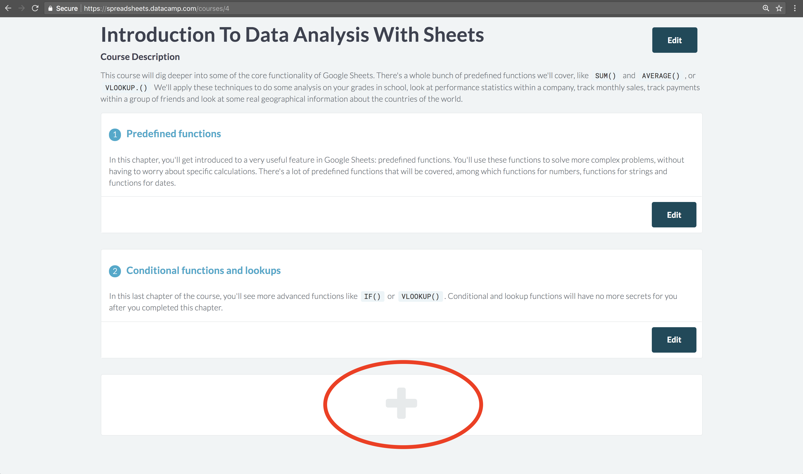
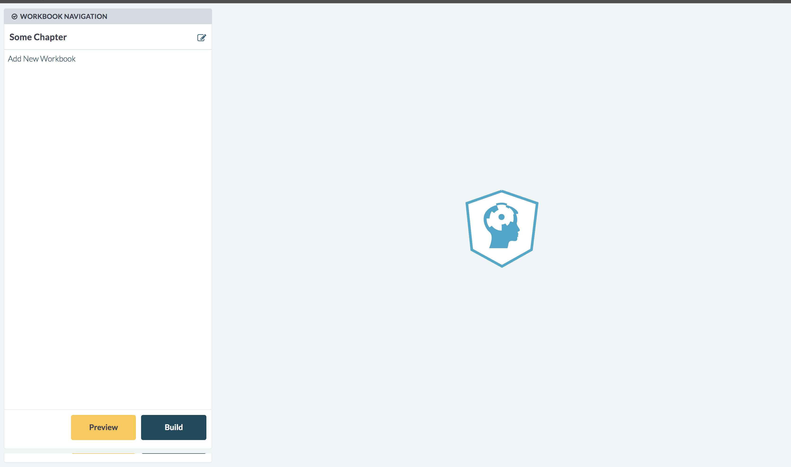

# Courses and chapters

In these sections we'll go through the processes for authors to create and edit courses or chapters
for spreadsheet courses.

## Courses

The first section will be about creating and editing course information on a spreadsheet course.

### Creating a course

For now, creating new courses on spreadsheets is closed. You'll have to reach out to
[vincent@datacamp.com](mailto:vincent@datacamp.com) directly in order to create a new course for you.

### Editing course fields

Editing a course happens through the _course authoring page_:

<figure>
  
  <figcaption><em>Fig 1: Course authoring page</em></figcaption>
</figure>

E.g. for a course with id **1** you can reach this page by browsing to:
https://spreadsheets.datacamp.com/courses/1. Just append your own course's id to that URL instead of
**1**.

There are two course specific fields you can edit:

* **Title**: the title of the course, obviously
* **Description**: the long description of the course

You can edit them through a modal when you hit 'Edit' next to the course title.

### Deleting a course

Deleting a course is disabled for now. You'll have to reach out to
[vincent@datacamp.com](mailto:vincent@datacamp.com) if you need to delete a course.

### Course slugs

By default, a course simply gets an id assigned to it. This is an integer, which means little to the
students when they see it appear in the course's URL. That's why we typically generate short pieces
of texts that can be used in the URL (called slugs). Search engines like it better as well.

For example, https://spreadsheets.datacamp.com/courses/4/chapters/8/exercises/1 will bring you to
the same location as
https://spreadsheets.datacamp.com/courses/data-analysis-with-spreadsheets/chapters/predefined-functions/exercises/1,
but the second one is prettier, right?

These slugs can be generated for you, but for now, you will still need to reach out to
[vincent@datacamp.com](mailto:vincent@datacamp.com) in order to do so. This is typically the last
step you want to do before you publish your course.

## Chapters

Now that you have your course set up, it's time to add some chapters.

### Creating a chapter

First, you'll need to create new chapters. On the bottom of the _course authoring page_ at
https://spreadsheets.datacamp.com/courses/<course_id_comes_here>, you'll see a big +-sign:

<figure>
  
  <figcaption><em>Fig 2: Add chapter through course authoring page</em></figcaption>
</figure>

If you click this, a pop-up will show up that allows you to fill in a title and long description of
the new chapter. **Don't worry, you can change these fields later on.** Hit 'Create' and your new
chapter will be created.

### Editing a chapter

Next to each chapter in the _course authoring page_, you'll see an 'Edit' button. If you hit this
button, it will bring you to a new interface, we'll call it the _chapter authoring page_:

<figure>
  
  <figcaption><em>Fig 3: Chapter authoring page</em></figcaption>
</figure>

If you haven't created any workbooks yet, you'll see a spinner that won't go away on the right-hand
side. This is considered normal behavior: a workbook will load once you created it - more on that
in the next section.

One thing to note here is that you can use this page to edit some of the fields of a chapter, namely

* **Title**: the title of the chapter
* **Description**: the long description of the chapter

You can do so by clicking the edit icon right of the chapter title. A pop-up will appear where you
can edit and save these fields.

### Deleting a chapter

Deleting chapters is currently not possible. If you come to a situation where you accidentally
created a chapter you don't need, reach out to [vincent@datacamp.com](mailto:vincent@datacamp.com).

### Chapter slugs

Similar to courses, chapters can also have a slug. This is something you'll need as the last step
before you publish a course. For now, reach out to
[vincent@datacamp.com](mailto:vincent@datacamp.com) in order to generate these.
