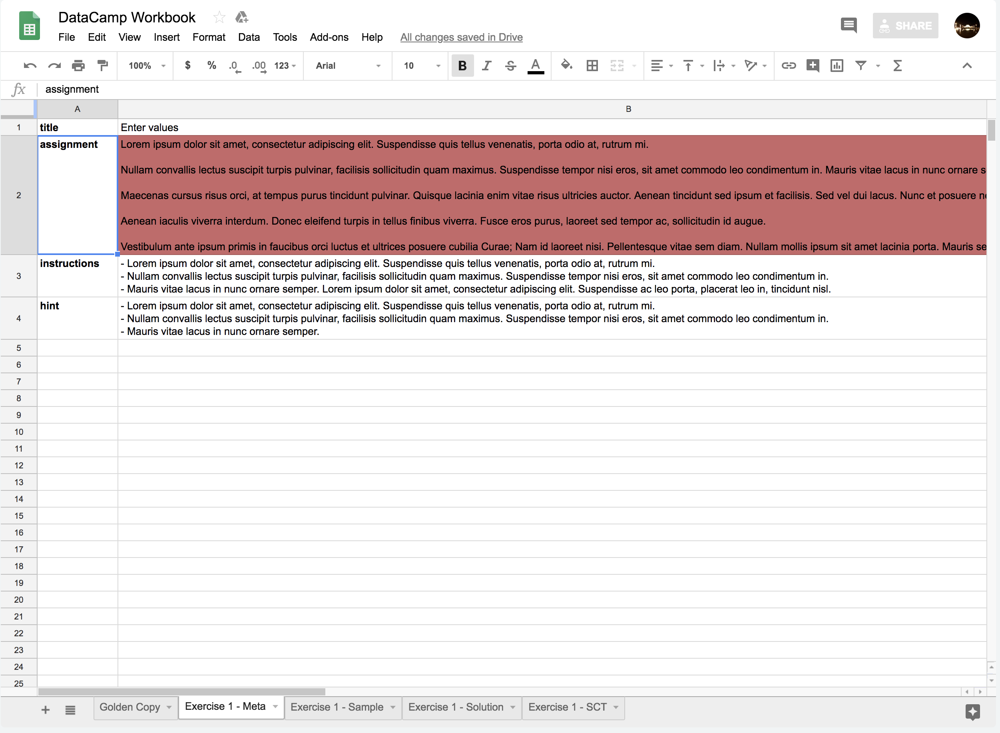

## Content guidelines

When writing exercises, a few criteria are checked in your meta sheets. These criteria will help you
write exercises that follow the DataCamp content guidelines. If you violate the guidelines, the
correspending fields will be highlighted in red. Your chapter will still build, but know that you'll
have to come back and fix this exercise.

The [guidelines for courses](../../guidelines/content.md) apply to spreadsheets courses to, so make
sure to go through them.
