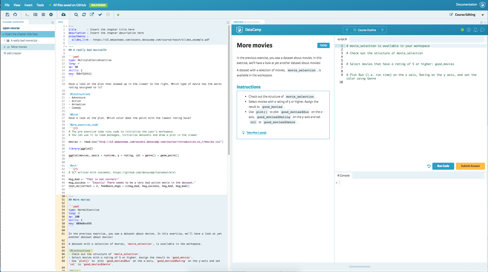

# Teach editor

Courses can be edited using the Teach Editor, an editor specifically built to create DataCamp courses. This editor can be reached by clicking the **Edit this Course** button on the [Content Overview](content-overview.md) page.

  
*Teach editor interface example*

## Features

Teach editor is going to provide you with several features in order to ease your content creation process.

### Navigation bar

Navigation bar offers different helpers and actions you can execute.

  
*Teach editor navigation bar example*

- **Save** You can use the save button to persist all your changes to Github
- **Github reset** You can use the Github reset button to **drop** all your current changes and reset them to the ones on Github
- **Add normal exercise** You can use "Add normal exercise" button. Once clicked editor is going to insert the scaffolded markdown to help you create the exercise.
- **Add multiple choice exercise** You can use "Add multiple choice exercise" button. Once clicked editor is going to insert the scaffolded markdown to help you create the exercise.
- **Add pure choice exercise** You can use "Add pure multiple choice exercise" button. Once clicked editor is going to insert the scaffolded markdown to help you create the exercise.
- **Add video exercise** You can use "Add video exercise" button. Once clicked editor is going to insert the scaffolded markdown to help you create the exercise.
- **Add assets** Once clicked a new dialog is going to be presented to you where you can select the files from your device and upload them in order to be used within your course. (Check [Assets](../courses/assets.md) for more information)
- **Find and replace** Once clicked it's going to provide you with ability to search through the whole course and replace the content if desired.
- **Refresh preview** Once clicked the course preview is going to be refreshed
- **Extract preview** Once clicked the preview is going to be opened in another window
- **Check spell checking** Once clicked your course is going to be checked for spelling errors. Any errors found are going to be marked in red color.

### Markdown editor

In order to help you authoring your content teach editor has a markdown editor which supports syntax highlighting, automcompletion and additional features such as spell checking, find and replace and under/redo operations.

Editor is used to edit Chapter and Exercises along with Slide Deck and slides information.

### Preview

It's always handy to see how your content is going to look like before publishing it to your students. By using preview you can make sure that the content and exercises are behaving as expected before pushing the content to your students.

## Handling content

With the Teach Editor, you edit markdown files that are also on GitHub. While using the editor, a version of the file is kept on the Teach Editor server. 

This means that when you accidentally close your browser window, your changes will not be lost. They're saved to our Teach Editor server! However they will be thrown away after two days. So if you're done working, it's always best to save your progress to GitHub.
