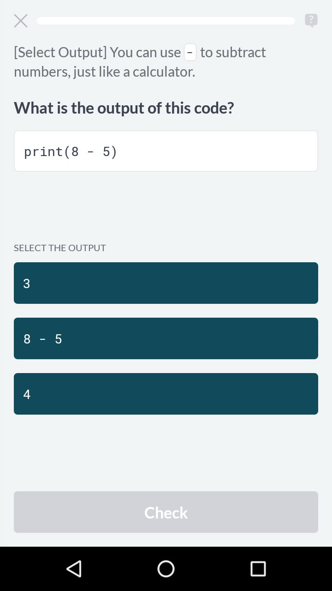

# Select Output

In a Select Output exercise, students are asked to select the output generated
by a given block of code. Select Output exercises require an output block
(because the output block is the correct solution), and a `distractor_output`
field. In a sense, Select Output is the reverse of a [Select
Code](select-code.md) exercise. In fact, all it takes to convert a Select Code
exercise to a Select Output exercise is to remove or comment the
`distractor_code` field and add a `distractor_output` field.

```yaml
# subtraction
- key: # generate me!
  context: "You can use `-` to subtract numbers, just like a calculator."
  output: "3"
  code: "print(8 - 5)"
  distractor_output:
    - option: "4"
      feedback: "8 - 5 isn't 4, try again."
    - option: "8 - 5"
      feedback: "The mathematical expression will be evaluated before it is printed."
```


