The format of a DataCamp Project notebook
=========================================

In a live DataCamp Project the student is working in a Jupyter notebook (the *Student notebook*), but the whole Projects is also authored as a Jupyter notebook: The *Project notebook*. The reason for using a Jupyter notebook as the authoring format is that the project can be developed locally, but still will have a similar appearance to the final live Project. 

To be used to build a final live project, a Project notebook needs to follow a specific format. It is that format that is described here. If you are following [the Project creation process](projects-process.md) a step before creating the full Project notebook, is to create just the narrative part of the notebook. You can find the format of the narrative notebook [here](projects-narrative-format.md).

Overview of the format {#overview}
----------------------

To be recognized by DataCamp's build system the Project notebook has to be named `project.ipynb`. The Project notebook can be written both in python and in R.

A Jupyter notebook consists of a number of cells, and the cell types used in a Project notebook are `code` cells and `markdown` cells. Cell *tags* are used to further specify what each cell corresponds to in the final live Project. Here is how to display cell tags in Jupyter:

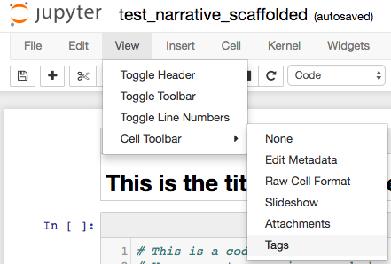

The first cell in a Project notebook should be a `markdown` cell with the project title written as a one-line H1 header. For example

```
# The Title of The Project
```

After that follows around 8 - 10 *tasks*, where each task consists of the following cells in the following order:

( `tag name` : `cell type` - *more info about the cell* )

1. `type:NotebookTask` : `markdown` - The title of the task. It should be an H2 header (`##`) and it should be numbered.
2. `@context` : `markdown` - The context for the task. Will be part of the student's notebook.
3. `@instructions` : `markdown` - The instructions for the task. Will be displayed in the sidebar.
4. `@hint` : `markdown` - The hint that will be displayed at the bottom of the sidebar.
5. `@sample_code` : `code` - The code scaffold that the student will edit in the live project. 
6. `@solution` : `code` - The solution to the task, it's currently not shown in the live project.
7. `@tests` : `code` - Tests that check if the student is doing the right thing in the task.

In the final live project this is where these cells end up:

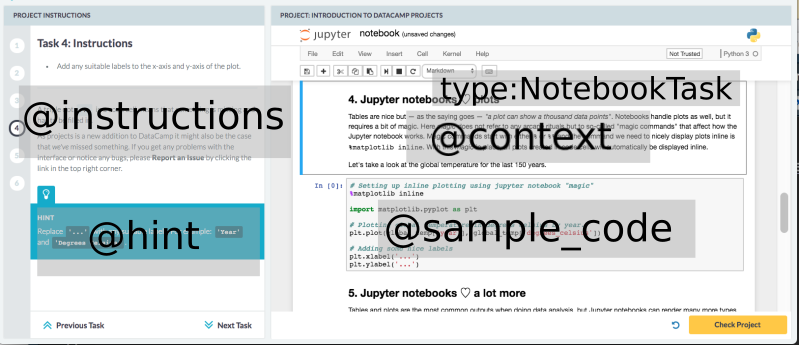

This image does not show the `@solution` and `@tests` cells as these are never shown to the student.

You are free to include any other cells in a Project notebook (for example to store material you're not using or for a todo list), but *all extra cells* -- except those having the tags above -- will be filtered away and will not be part of the final live project.


> #### info::Check out a live project! 
> Maybe the easiest way of understanding the structure of a DataCamp Project notebook is to check out an already existing Project. For example, download and take a look at the `project.ipynb` in *Dr. Semmelweis and the discovery of handwashing*. Here is the [python GitHub repo](https://github.com/datacamp/projects-discovery-of-handwashing-python) (and [live project](https://projects.datacamp.com/projects/20)), here is the [R GitHub repo](https://github.com/datacamp/projects-discovery-of-handwashing-r) (and [live project](https://projects.datacamp.com/projects/49)).

The format of the different cells
-----------------------------------------------------

 > `type:NotebookTask` : `markdown` < {#notebooktask}
 ----------------------------------------------------

This is the `markdown` cell that marks the beginning of a new task. It should contain a one-line, second lever header (H2), with the title of the task. In markdown a second lever header is written like this: 

```
## A H2 header in markdown
```

**Style guide:**

- The title of the task should be manually numbered: `## 1. Like this`

**Example**
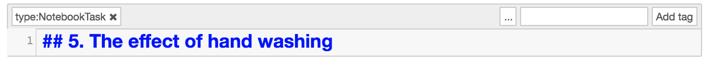

-----------------------------------------

> `@context` : `markdown` < {#context}
-----------------------------------------

This is the `markdown` cell that will be part of the student's notebook in the final live project. It can contain any markdown. To include an image: Place the image in the `img/` folder, located in the same folder as the `project.ipynb` file, then link to it from the `markdown` cell like this: ``.

**Style guide:**

- Keep it short. One sentence is fine, 800 characters is max.
- Make sure that images you use have a permissive license.
- The context is part of the "unfinished" student's notebook. When the student has finished the project, it should read as an analysis/case study/blog post. Therefore the context should not be addressed to the student, but to a general audience as if the project was already finished and published as a blog post.
  - Good: Now let's load in the data and take a look at the first couple of rows.
  - Bad: Now you should use `read_csv` to read in the data.


**Example**
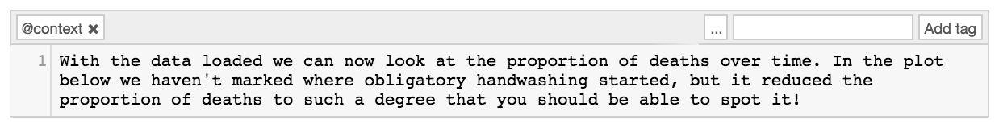

--------------------------------------------------

> `@instructions` : `markdown` < {#instructions}
--------------------------------------------------

This is the `markdown` cell that will be part of the instructions sidebar. It can contain any markdown. To include an image: Place the image in the `img/` folder, located in the same folder as the `project.ipynb` file, then link to it from the `markdown` cell like this: ``.

**Style guide:**

- The `@instructions` should
  - Start with a bullet list of what the student should do in the task. Max 5 bullets.
  - Then have a horisontal ruler tag (`<hr>`.)
  - After that follows (optional) help / hints / links to relevant documentation / stackoverflow / etc.
- Ideally, the student should not need to scroll to view the instructions. That means max 800 characters.
- The instructions are directed directly to the student. They should be concrete and concise.
  - Good: Label the plotted lines using the `label` argument to `plot`.
  - Bad: Here we will label the plotted lines. If we want to, we could use the `label` argument to `plot` to achieve this.
- It can be nice to link to external documentation, to help the student. But this should be done in moderation.

**Example**
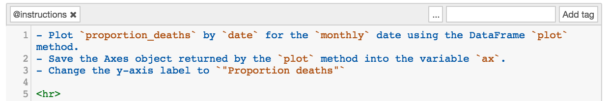

### The `@instructions` of the first task ###

The `@instructions` to the first task should include a "Good to know" section where you direct the student to resources that could be useful throughout the Project. This could be external documentation, DataCamp courses and exercises, cheat sheets, Stack Overflow answers, etc. The "Good to know" headline should be written as an H3 header:

```
### Good to know
```

**Example first task `@instructions`**:
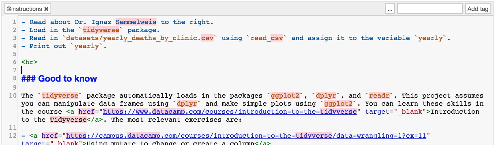

---------------------------------

> `@hint` : `markdown` < {#hint}
---------------------------------

This is the `markdown` cell that populates the *hint tab* at the bottom of the instructions sidebar. While the `@instructions` can also include help and hints, the hint tab is meant for Students who are *stuck*. 

**Style guide:**

- Make it helpful! Students can't view the solution, so the hint tab is the last resort.
- As in the `@instructions` feel free to include links to documentation and code snippets in the hint. 

**Example**
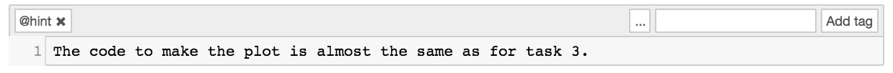

-------------------------------------------

> `@sample_code` : `code` < {#sample-code}
-------------------------------------------

This is the `code` cell that will show up in the student's notebook. It should have the same disposition as the `@solution` but with parts or all of the code missing. The purpose of the `@sample_code` is to give the student enough structure and code scaffolding to be able to complete the task. 

**Style guide:**  

- The student should have to complete between 1 to 5 lines of code.
- Use `...` in python and `....` in R to indicate that code needs to be filled in.
  - For code within a line: 
    ```
    # For Python
    horse_data = ...
    
    # For R
    horse_data <- ....
    ```
  - For code where one or more lines are missing:
    ```
    # For Python
    # ... YOUR CODE FOR TASK 3 ... 
    
    # For R
    # .... YOUR CODE FOR TASK 3 ....
    ```
- Structure the `@sample_code` so that there is a clear correspondence to the task instructions. Rule of thumb: Each bullet point in `@instructions` should correspond to a comment in the `@sample_code`.
- It is fine to include some "finished" code in the `@sample_code`, if you think it would be too hard for the student to produce it her/himself.

**Example**
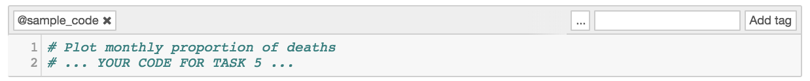

-------------------------------------

> `@solution` : `code` < {#solution}
-------------------------------------

This is the `code` cell that is the completed version of the corresponding `@sample_code`. Currently, it is never shown to the student, but might be in the future.

**Style guide:**

- The `@solution` should mirror the corresponding `@sample_code`, but with the missing parts filled in.
- It should take *at most* 5 seconds to execute on an average laptop.
- It should consist of between 1 to 10 lines of code.
- For python
  - Use `underscore_separated` identifiers.
  - Use 'single quotes' for strings.
- For R
  - Use `underscore_separated` identifiers.
  - Use "double quotes for strings.
  - Use the `<-` arrow for assignment. 


**python example**
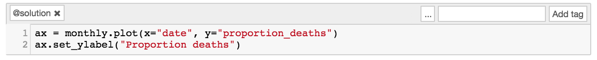

**R example**
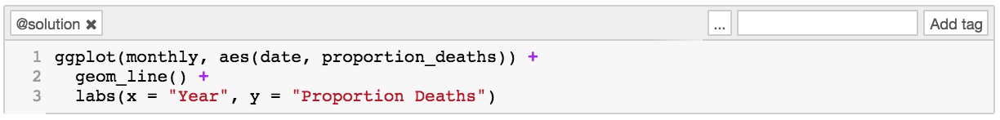

--------------------------------------

> `@tests` : `code` < {#tests}
--------------------------------------

This is the `code` cell that checks the Student's solution to the task. The main purpose of the `@tests` is to try to catch common errors and to give the student hints on how to resolve the errors. The purpose of the `@tests` is *not* to check every detail of the student's solution. The idea is just to check *something* to give the student a sense of achievement when s/he completes a task.

**Style guide:**

- The `@solution` should pass the tests.
- A good test message explains what the code should be doing, and hints at the solution
  - Good: The column `date` should be converted using the `pd.to_datetime()` function.
  - Bad: `date` is wrong.

### Tests for python ###

For python, the tests are written using [the nose testing framework](http://nose.readthedocs.io/en/latest/#installation-and-quick-start) and uses the [`ipython_nose` magic](https://github.com/akaihola/ipython_nose). Every `@tests` cell needs to start with the [ipython_nose magic](https://github.com/akaihola/ipython_nose) `%%nose`. 

[**Click here for examples of different python tests and for how to install nose and ipython_nose**](projects-test-examples.md/#tests-python).

**python example:**
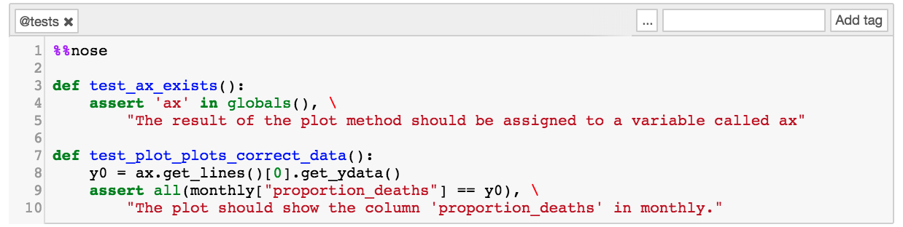


### Tests for R ###

For R, the tests are written using [the testthat framework](https://github.com/r-lib/testthat) and needs the [IRkernel.testthat](https://github.com/datacamp/IRkernel.testthat) package to work within the notebook. Every `@tests` cell needs to include a call to `run_tests({...})`, and the first `@tests` cell in the Project notebook needs to load in the packages `library(testthat)` and `library(IRkernel.testthat)`

[**Click here for examples of different R tests and for how to install testthat and IRkernel.testthat**](projects-test-examples.md/#tests-r) .

**R example:**
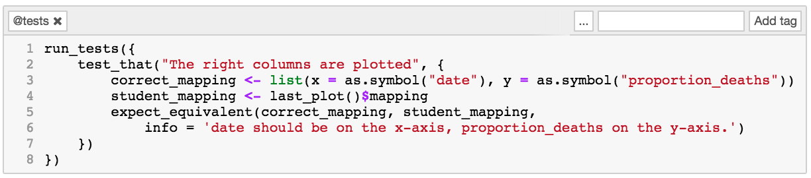