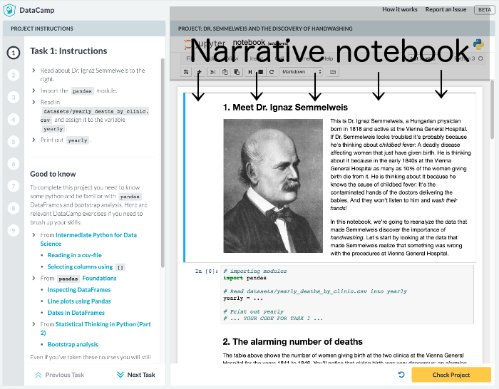
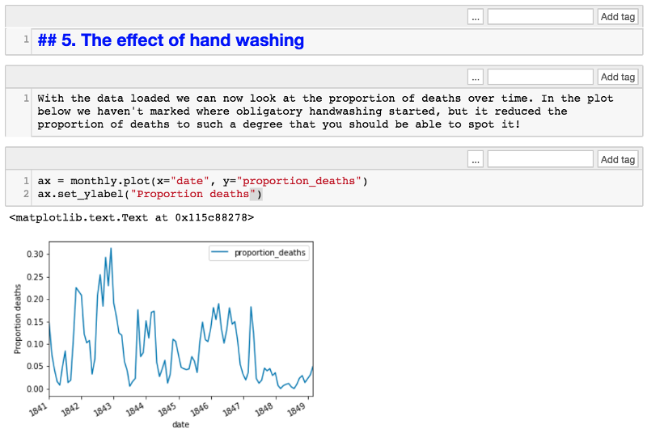

The format of a Narrative notebook
=========================================

If you are following [the project creation process](projects-process.md), then one of the first steps is to create the *narrative notebook*.

The *narrative notebook* is a Jupyter notebook that only contains the case study / analysis / data narrative the DataCamp Project is built around. For the student, the goal of a Project is then to recreate this narrative notebook by completing the missing code in the student's notebook.




The narrative notebook starts with the Project title: a `markdown` cell with a single H1 header, like this:

```
# This is the Title of the Project
```

Then follows around 8 to 10 *tasks*, where each task consists of

1. **Task title** - A `markdown` cell with the title of the task written as a H2 header: `## 1. Like this`
2. **Context** - A single `markdown` cell with text/story/description.
3. **Code** - A single `code` cell with the code of the task.

(If one was writing, say, a blog post or an analysis, one wouldn't usually split it up into *tasks*. But this is necessary to do for the narrative notebook to later map each task to instructions.)

**Example of a narrative notebook task**


**Style guide:**
- **General**
  - The narrative notebook is not addressed directly to the student. Rather, it's supposed to read as an analysis / case study / blog post written for a general audience. 
- **Task title cell**
  - The title of the task should be manually numbered: `## 3. Like this`
- **Context cell**
  - Keep it short. One sentence is fine, 800 characters is max.
  - Make sure that images you include have a permissive license.
- **Code cell**
  - It should take *at most* 5 seconds to execute on an average laptop.
  - It should consist of between 1 to 10 lines of code.
  - For python
    - Use `underscore_separated` identifiers.
    - Use 'single quotes' for strings.
  - For R
    - Use `underscore_separated` identifiers.
    - Use "double quotes" for strings.
    - Use the `<-` arrow for assignment. 

> #### info::Check out an existing narrative notebook! 
> Maybe the easiest way of understanding the structure of a narrative notebook is to look at an example. Here are the R and python narrative notebooks behind the project *Dr. Semmelweis and the discovery of handwashing*. Here is the [python narrative notebook](https://github.com/datacamp/projects-discovery-of-handwashing-python/blob/master/project_narrative.ipynb) (and [live project](https://projects.datacamp.com/projects/20)), here is the [R narrative notebook](https://github.com/datacamp/projects-discovery-of-handwashing-r/blob/master/project_narrative.ipynb) (and [live project](https://projects.datacamp.com/projects/49)).