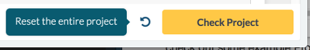

The Project creation process
=============================================

This page details steps you go through when you create a *premium* DataCamp Project. If you're interested in creating a premium Project, please email projects@datacamp.com for more info!

Overview
--------------

Here are the steps for creating a DataCamp Project:

1. [Prerequisites for making a Project](#projects-prerequisites).
  - Before you can create a DataCamp project, you need access to two tools: Jupyter notebooks and GitHub. You should also check out some example Projects.
2. [Coming up with a good topic](#projects-a-good-topic)
  - The first step when creating a Project is to come up with a good topic.
3. [Writing the Project specification](#projects-writing-specification).
  - When you know the topic of your Project, you'll complete a short *Project specification*. When both you and your DataCamp contact have OK'd the Project specification, you sign a contract and can now go ahead and create the Project.
4. [Writing the Project notebook](#projects-writing-notebook).
  - When the Project spec is finished, your DataCamp contact will add a scaffold around it, where the instructions and tests will go. With this scaffold in place, you can complete the rest of your Project.
5. [Launching the Project](#projects-launching).
  - When the Project notebook is finished, we will beta test it and launch it on DataCamp. As part of the launch, you'll make an unpretentious introduction video to your Project. 

During this process, you will work closely with your DataCamp contact, and each step above also includes receiving and integrating feedback from your DataCamp contact.

## 1. Prerequisites for making a Project {#projects-prerequisites} ##

Writing a DataCamp project is similar to writing an educational blog post or case study. The only formal requirement for creating a DataCamp project is therefore that you've already published some educational writing of your own, for example, in the form of a blog post, notebook, article, book or internal case study.

Before you create a DataCamp Project, you should check out some of the existing projects to get a feel for the format. We recommend that you complete:

* *Introduction to Projects and Jupyter notebooks*
  - python: https://projects.datacamp.com/projects/33
  - R: https://projects.datacamp.com/projects/41
* *Dr. Semmelweis and the discovery of handwashing*
  - python: https://projects.datacamp.com/projects/20
  - R: https://projects.datacamp.com/projects/49

To create a DataCamp project you'll only need to use two tools: Jupyter notebooks and GitHub.

### Jupyter notebooks {#jupyter-notebooks}

From [jupyter.org](http://jupyter.org/):

> The Jupyter Notebook is an open-source web application that allows you to create and share documents that contain live code, equations, visualizations and narrative text.

If you're doing data science in python chances are you're already using Jupyter notebooks. Coming from the R side, a Jupyter notebook is similar to an R-markdown document: it allows you to mix code, markdown, and output in an interactive document. A DataCamp Project is presented to students as a Jupyter notebook, but the Project spec and the final Project is *also* authored as notebooks. Jupyter notebooks work both with python and with R but rely on python for the interface. Here are some useful resources:

* [Instructions for how to install Jupyter](http://jupyter.org/install.html). Make sure to chose python 3.
* If you are creating a Project in R you also need [the R-kernel for Jupyter](https://irkernel.github.io/installation/).
* A quick video introduction to Jupyter: https://youtu.be/Hr4yh1_4GlQ
* All text in a Jupyter notebook is written using markdown. If you don't know markdown, you can learn it in 10 minutes here: http://commonmark.org/help/tutorial/index.html

### GitHub

GitHub is a web front-end for the Git version control system and is where all the files of your final Project will live. If you don't already have a GitHub account you can sign up for free here: https://github.com/ . If you need to get up to speed with using git, we recommend this tutorial: https://try.github.io/ .

## 2. Coming up with a good topic {#projects-a-good-topic} ##

> A Project should allow students to take the skills they have learned and apply them in an end-to-end analysis, on a real-world **task**, using real-world **tools** and **workflows**.

To this end, here are some guidelines for what makes a good Project:

- **The more applied the topic of the Project is, the better.** Areas the Project topic could come from include, but are not limited to: Healthcare, finance, online retail, applied research, official statistics, software engineering, mobile gaming, insurance, education, media & entertainment, logistics, web analytics, etc. 
- **Real-world case studies are a good basis for a Project.** A goal of DataCamp projects is to give Students real-world experience, with real-world datasets. A topic related to your company or research could make a great Project. It is no problem, rather the opposite, if you want to feature your company or institution as part of the Project.
- **A Project should be doable during a Lunch break.** While the name "Project" signals a large undertaking, this should not be the case. A DataCamp student should be able to complete a Project in less than an hour, and "short case study" would be a more fitting description. 
- **Students should be able to apply what they've learned in DataCamp courses.** Students on the DataCamp platform learn new tools in courses and apply these tools in Projects. A challenge with creating a Project is to make sure that Students can learn the skills required to complete it from a DataCamp course. If you are uncertain what's covered in DataCamp courses, then your DataCamp contact will help you with this. 

It is generally no problem if you want to re-purpose already existing material (such as a blog post or existing case study) as a DataCamp project.

Fill out the following information and email it to [projects@datacamp.com](mailto:projects@datacamp.com):

- **Dataset description**: 1 sentence describing the dataset and the file type. Example: "A CSV file that contains anonymized patient blood sugar level data."
- **Dataset size**: the size of the dataset in MB or GB. Example: “300 MB."
- **Link to dataset**: please attach the dataset in the email, send it via Google Drive, send me a link to where it is hosted online, etc.
- **Overview of Project tasks**: a comma-separated list of tasks the students will perform in the Project. Example: "Import data, clean data, visualize data."
- **Packages used**: the packages used in the Project. Example: “dplyr and ggplot2.”

## 3. Writing the Project specification {#projects-writing-specification} ##

When you've come up with a topic for your Project the next step is to complete a *Project specification*: A short document that outlines the topic of your project and the skills necessary to complete it. The Project spec is written as a Jupyter notebook, so to edit it you need to have Jupyter installed on your local machine ([see here](#jupyter-notebooks) for more info).

The Project spec should be self-explanatory and is available here:

* <a target="_blank" href="notebooks/datacamp_python_project_spec.ipynb">Project spec notebook for python</a>.  [Preview it on GitHub](https://github.com/datacamp/authoring/blob/master/docs/projects/notebooks/datacamp_python_project_spec.ipynb).
* <a target="_blank" href="notebooks/datacamp_r_project_spec.ipynb">Project spec notebook for R</a>.  [Preview it on GitHub](https://github.com/datacamp/authoring/blob/master/docs/projects/notebooks/datacamp_r_project_spec.ipynb).

When you've completed the Project spec just e-mail it to your DataCamp contact. Make sure to include all external resources (like datasets, images, etc.) as e-mail attachments, or put them online and link to them from the notebook. 

When both you and your DataCamp contact have OK'd the Project specification, the Project creation process officially begins:

* You and DataCamp will sign a Project authoring contract. Please ask your DataCamp contact if you have questions about this contract.
* Your DataCamp contact will set up a GitHub repository for your Project. Until the Project is released, you will work in the `develop` branch of the repository. 
* Your DataCamp contact will copy the relevant parts of the Project spec into `project.yml` (the metadata of your project) and `project.ipynb`. Here is [more information about the filestructure of a Project](projects-repo-structure.md).

## 4. Writing the Project notebook {#projects-writing-notebook} ##

A finished Project consists of a Jupyter notebook that contains a data narrative, which is supplemented by instructions, hints, and correctness checks. When you've completed the project spec, your DataCamp contact will add a scaffold around it -- with all the code and markdown cells required in a finished Project -- and put it into the `project.ipynb` notebook in your GitHub repo. It is now up to you to fill in the scaffold and complete the Project.

See the [Project notebook format](projects/projects-format.md) for instructions and a style guide. 

The steps of completing the Project notebook are:

1. Finish the first three tasks. This includes completing the context, instructions, hints, sample code, solutions, and tests for the tasks. After completing the three first tasks notify your DataCamp contact so the s/he can review them.
2. Then finish the rest of the project. Notify you DataCamp contact whenever you want feedback on your progress.

We recommend that you regularly preview how your project will appear on datacamp.com. Every time you push an update to GitHub a new live version of your project will be built. You'll find links to a dashboard where you can monitor the build process and preview the project in the `README.md` file in the Project's GitHub repo.

### Two quirks

*A current quirk is that the live preview of your project won't auto update, and you need to reset the project manually to make the latest version show.*

*Another quirk is that the system that puts the project on datacamp.com won't accept Jupyter notebooks larger than 1 mb. To make sure that your notebook isn't too large, you need to clear the cell outputs before committing.*

*We're working on fixing these quirks, but currently you need to use the workarounds above.*

## 5. Launching the Project {#projects-launching} ##

When you have completed the Project notebook your DataCamp contact will send out the Project to a small group of DataCamp subscribers that will complete the Project and give feedback on it. When you've incorporated the feedback into the Project, it is ready for release on DataCamp.com!

### Maintaining your Project

Even though your Project has been beta tested, there might still be bugs/mistakes to iron out. The DataCamp subscribers doing your Project can leave feedback and report issues.Your DataCamp contact will collect these issues and report them to you at three points in time: (1) When your Project is released, (2) two weeks after release, and (3) two months after release. As the author of the Project, it is then your responsibility to make sure that DataCamp subscribers can complete and enjoy the Project.
