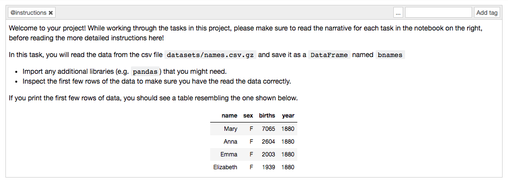

# USP of DataCamp Projects

This section lays out some thoughts on what I believe is the USP of DataCamp Projects, that makes it superior to our competition.

__Clean separation of narrative from pedagogy__

A lot of projects mix the narrative and the pedagogy in the notebook. At DataCamp, we recognize that the narrative is a storyline that students want to share, and so we keep it pristine, and devoid of any instructional or pedagogical elements. All pedagogical elements that support the project are available in the sidebar. We believe that this design maximizes the utility a student can derive from the project.

__Supervised, yet flexible coding environment__

Competing platforms usually provide either a fully supervised learning environment, where a coding task needs to be completed exactly to specifications, leaving little flexibility for the end user (Coursera, Udacity), or a totally flexible environment, where they can write code in a totally flexible way. The advantage of a supervised learning environments is that it is easy to write tests, but the tests are usually very stringent, making it imperative to provide ample code scaffolding, thereby sacrificing flexibility.

Our implementation of projects works around this in a few ways:

1 | While the narrative describes the high-level objectives of the task, the instructions provide a lot of detail into what is expected from the user. The instructions focus on what are the required elements of the output, and also shares output snippets, making it very clear what is to be expected. As the instructions focus on what needs to be done, rather than how it needs to be done, it provides the user with a lot of flexibility in terms of writing code.

2 | The **tests** are written only to test certain properties of the user output that are made amply clear in the instructions. This lets the user write code in a very flexible way, while still being able to address the requirements of the task, based on the output requirements that are made explicit in the **instructions**.

3 | Sometimes, it is hard to complete a task successfully. The only way to proceed in such cases, usually, is to take a peek at the final solution. Our implementation supports hints, that are aimed as an intermediate step to nudge the user to the final solution, without having to take a look at the fully completed solution.
