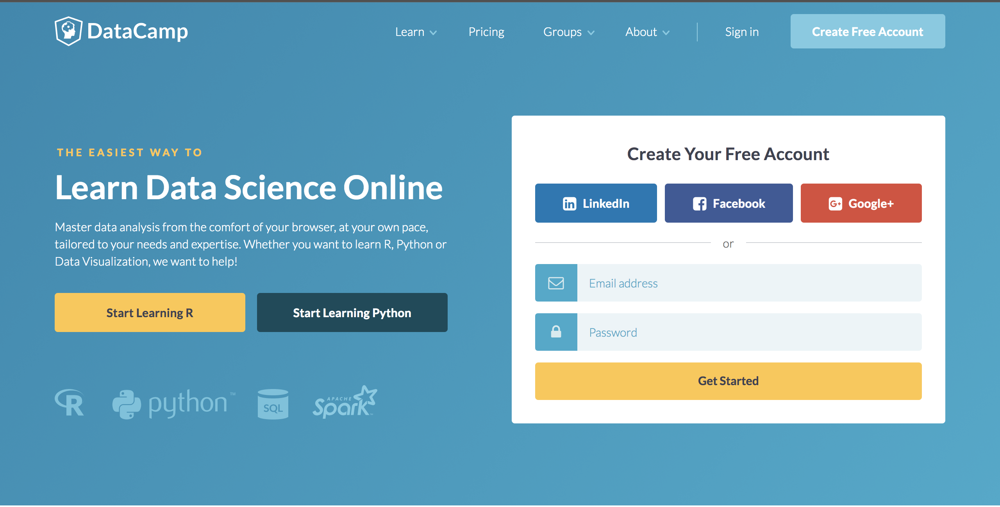
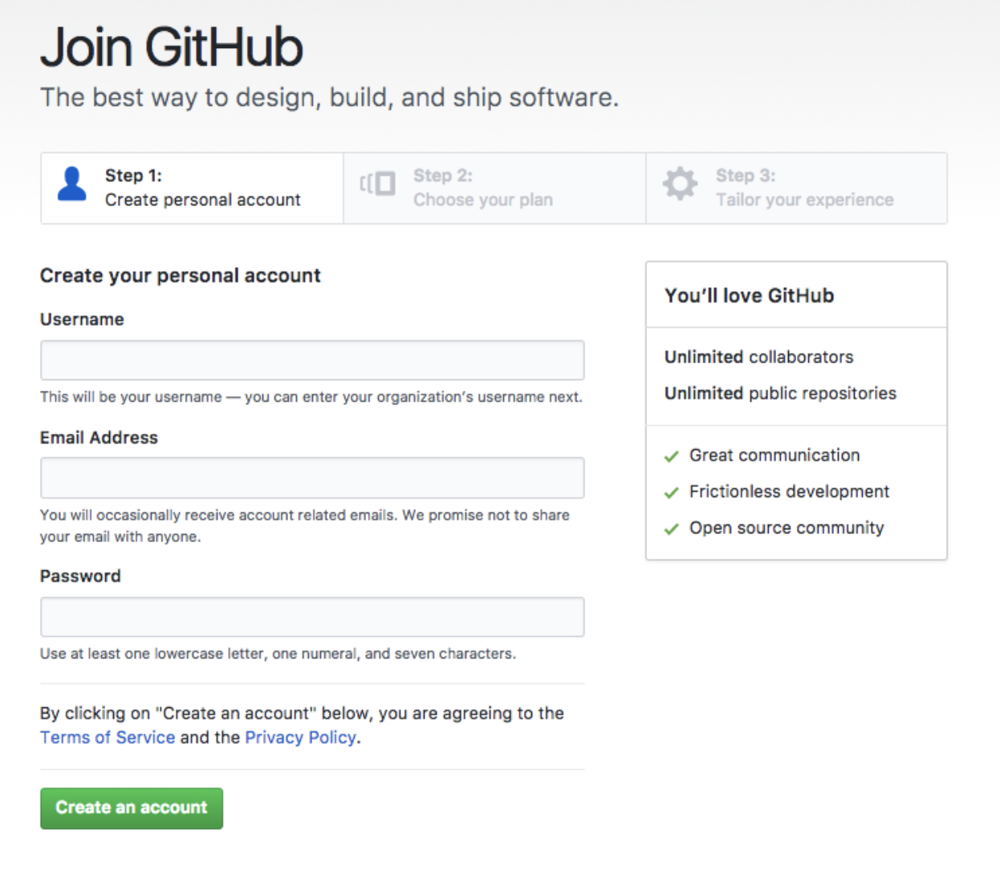
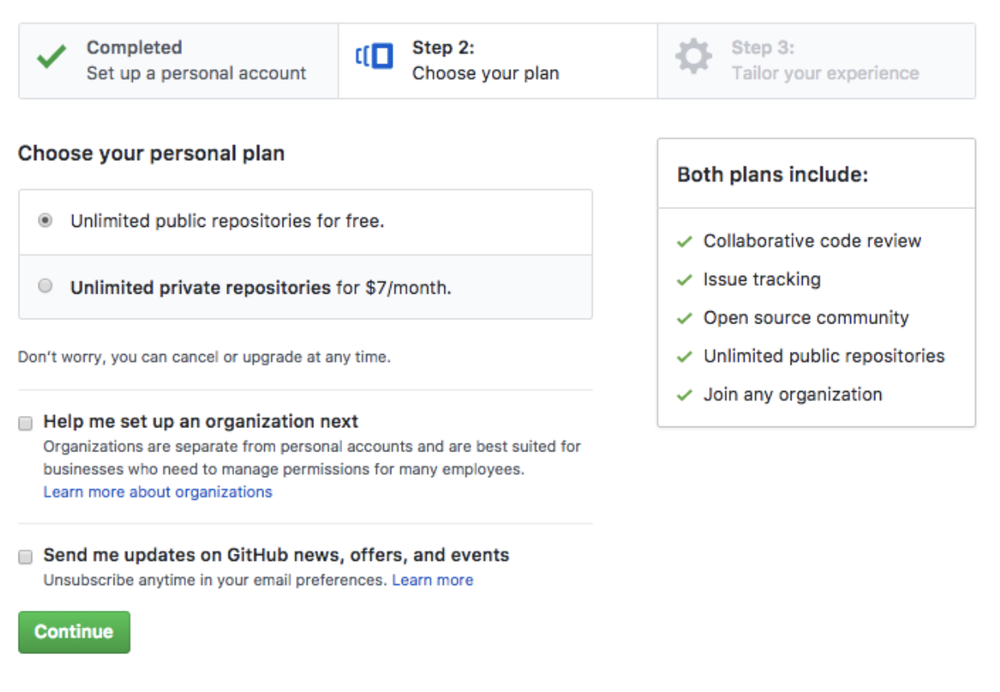
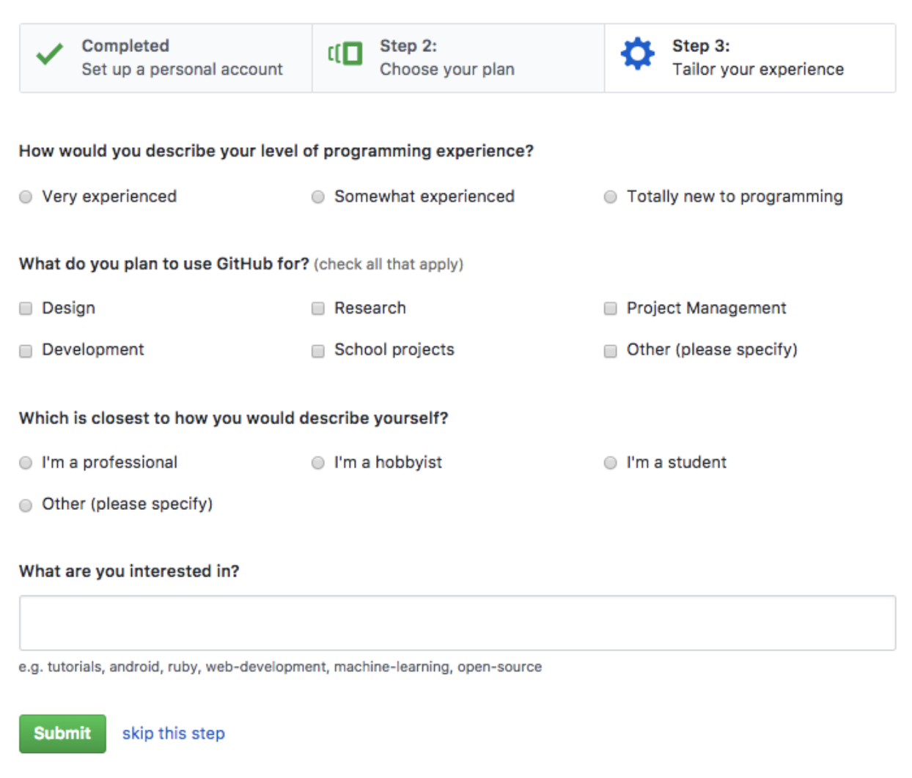

# Getting started

In order to start creating courses, challenges and projects on DataCamp platform you need to fulfill following prerequisites:

- Create DataCamp account
- Create Github account
- Authorize DataCamp to manage your Github account

You can start by following the steps from the "Getting started" video:
153250442

While you can also read the upcoming sections which are going to guide you through the process of creating the necessary accounts.

## DataCamp Account

Creating a DataCamp account is a straightforward process. Visit [www.datacamp.com](https://www.datacamp.com/) and enter your credentials.

Once you have created your DataCamp account you can proceed with creating your Github Account.

## Github Account

DataCamp uses Github as platform for hosting, versioning and collaborating on content.  
In case you are not familiar with Git we highly recommend you to take the [official Github tutorial](https://try.github.io).

Now that you are more familiar with Git you can proceed with creating your Github account.

### Creating the new account
To create a new account visit [Github registration](https://github.com/join?source=header-home) and complete three steps process.

The first step is providing login information:

Fill in all the required fields being:
- Username
- Email
- Password

Then click "Create new account" button to proceed to the next step.

As a part of second step you will need to choose the Github plan:

> #### info::Note
> _Paid plan is preferred if you are going to create content which needs to be private, meaning non accessible by other Github users_

We recommend you to start with the _Unlimited Plan_ and upgrade at later stage when and if it becomes necessary.

The last step is completing your Github registration.

There is no need to provide answers to any of the fields. You can proceed with clicking on "Submit" button in order to complete your Github account registration.

## Link DataCamp and Github account

In order for DataCamp to access your content on Github you will need to grant access to DataCamp. It sounds a bit scarier than it is. Follow these steps to authorize DataCamp for managing your Github account:

1. Login to your DataCamp account by clicking [here](https://www.datacamp.com/users/sign_in)
2. Visit DataCamp for Teachers by clicking [here](https://www.datacamp.com/teach)
3. You will be prompted to authorize DataCamp to manage your Github account:

Click on "Link Github Account" button
4. You will be redirected to Github where you need to click "Authorize" button
5. Once authorization is complete you will see the DataCamp for Teachers

Now you are ready to start creating your content. You can proceed by [creating a course](../courses/README.md).