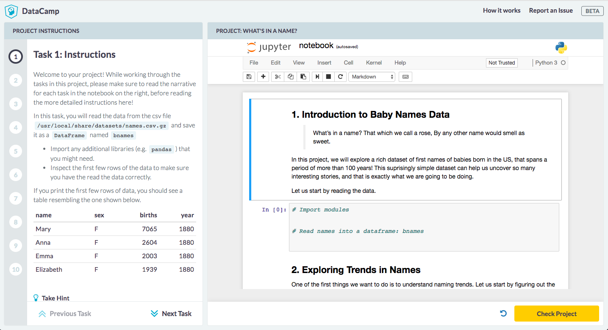

# Projects



Projects use a simple directory structure.

```text
|- README.md\*
|- project.yml\*
|- project.ipynb\*
|- datasets/
|- img/
|- requirements.sh
|- notebooks/
```

An overview of each file/folder is provided below.

| **File**                                                                                        | **Description**                                                                                                                                     |
|-------------------------------------------------------------------------------------------------|-----------------------------------------------------------------------------------------------------------------------------------------------------|
| README.md                                                                                       | Describe the project and links to Teach and Project App.                                                                                            |
| project.yml                                                                                     | Project metadata. See [*here*](#add-project-metadata) for more details                                                                              |
| [*project.ipynb*](https://github.com/datacamp/projects-babynames/blob/master/project.ipynb)     | Project notebook with tasks. See [*here*](#authoring-a-project) for more details.                                                                   |
| [*datasets/*](https://github.com/datacamp/projects-babynames/tree/master/datasets)              | Folder with datasets used by the project.                                                                                                           |
| img/                                                                                            | Folder containing project images like the shield                                                                                                    |
| [*requirements.sh*](https://github.com/datacamp/projects-babynames/blob/master/requirements.sh) | Bash script to install necessary packages and bake datasets into image                                                                              |
| notebooks/                                                                                      | Supporting notebooks (e.g. [*notebook to download data*](https://github.com/datacamp/projects-babynames/blob/master/notebooks/download-data.ipynb)) |

Detailed information on how the build process for projects works, is available on the [*Teach App Wiki*](https://github.com/datacamp/teach-app/wiki/Projects-Workflow).
